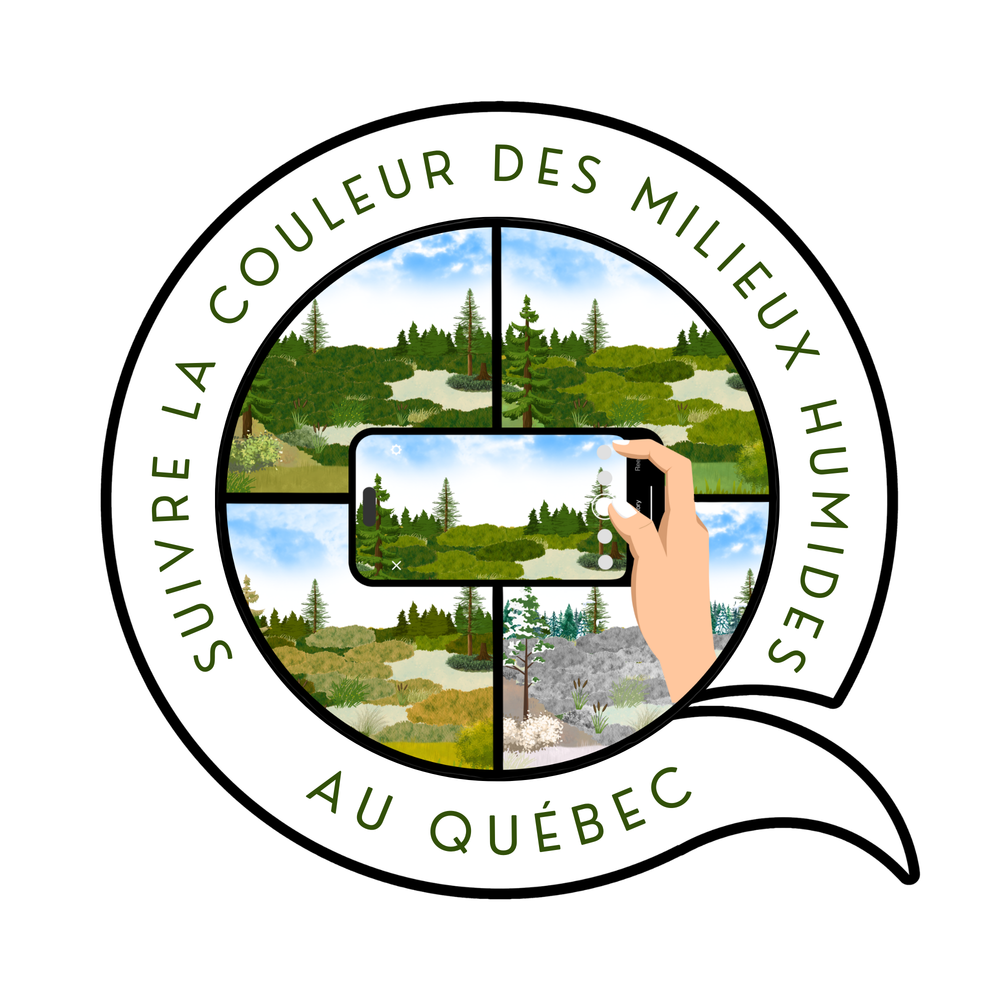
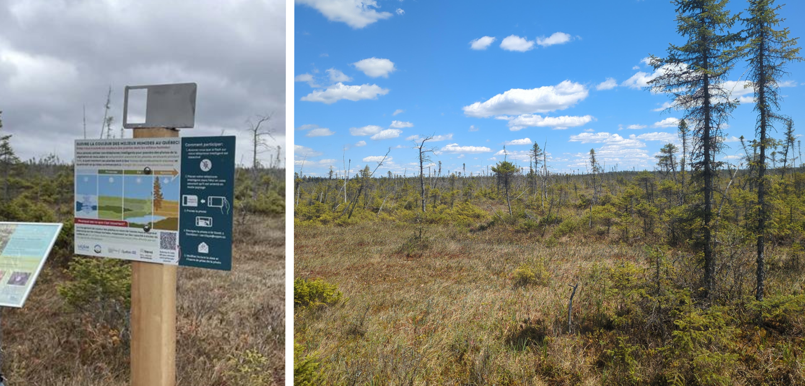
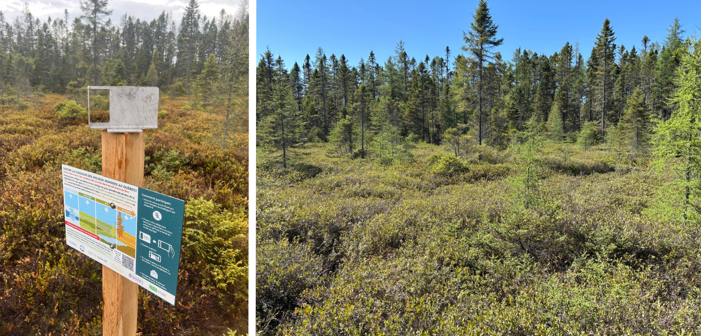
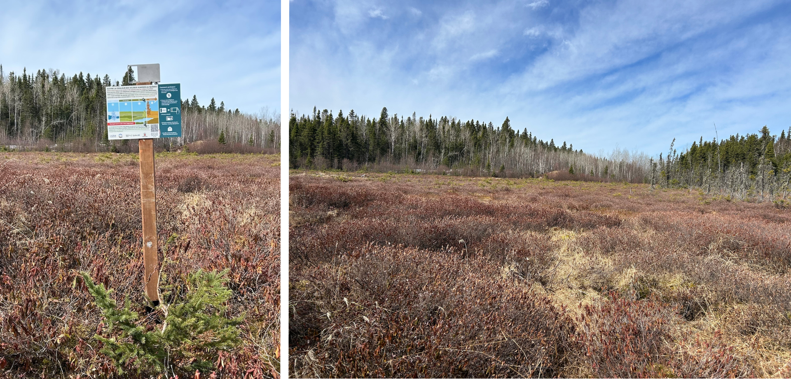
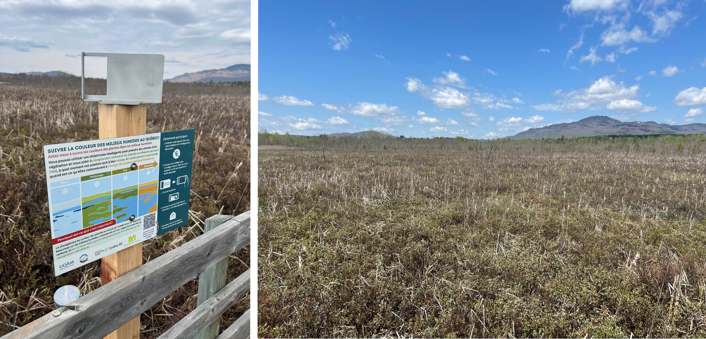
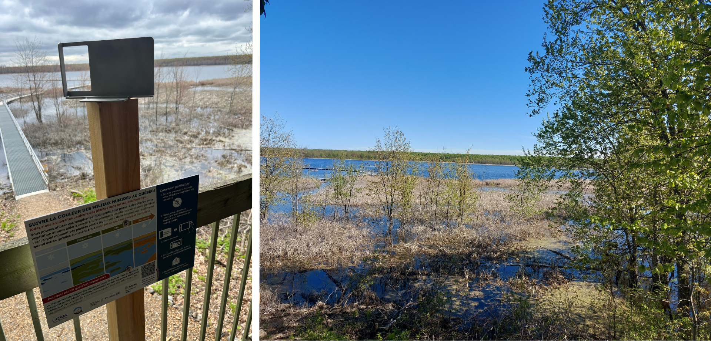
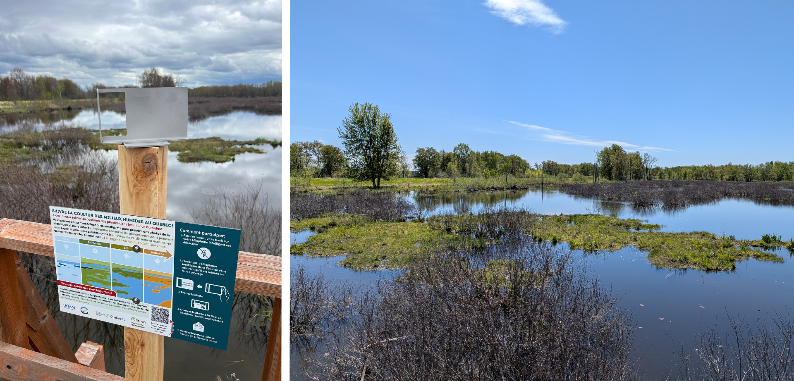
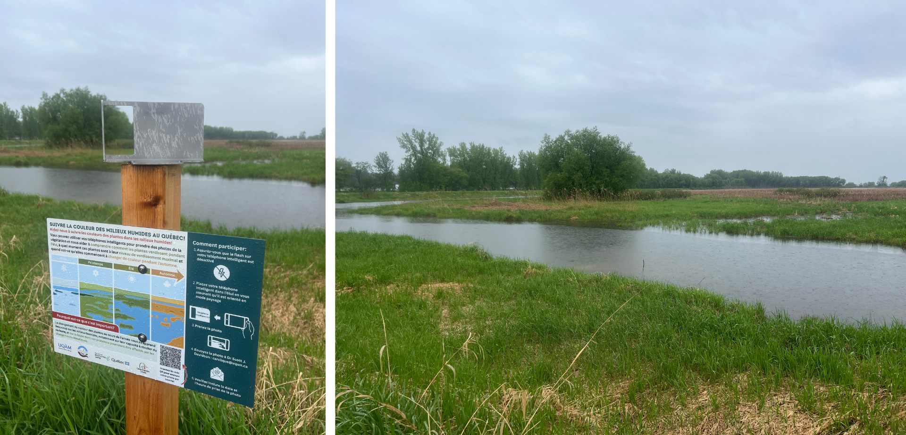
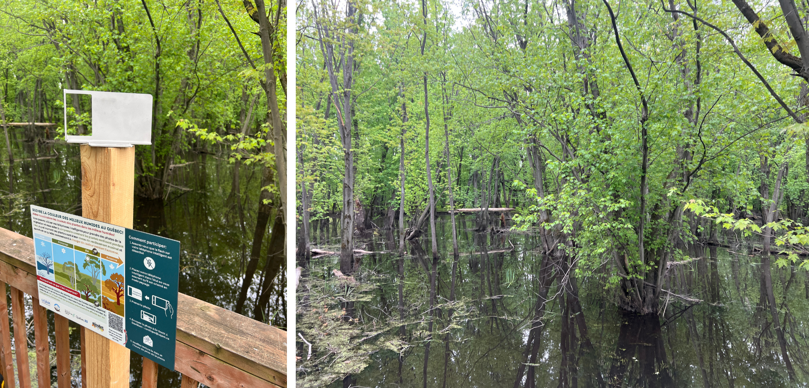
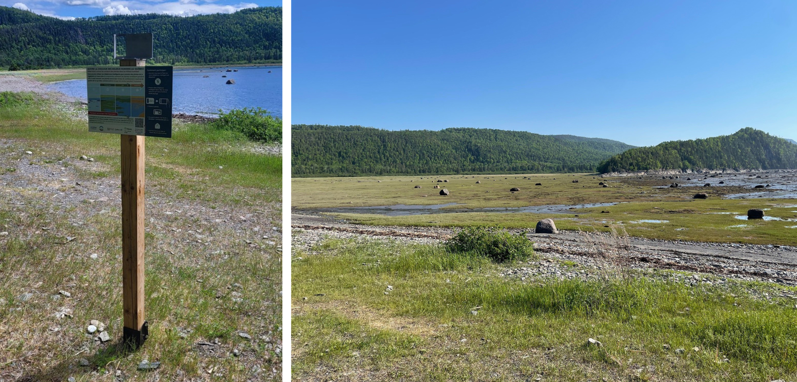

  

  <iframe 
    src="https://peatcolours.shinyapps.io/quebec-map-app/" 
    title="sites de milieux humides au Québec"
    scrolling="no"
    frameborder="0"
    style="border: 0; width: 100%; height: 100%;">
    
Your browser does not support iframes.

  </iframe>

## Détails du site

### Québec

<strong>Parc national de Frontenac</strong>

**Emplacement** : Québec, Canada 
**Type de milieux humide** : tourbière ombrotrophe 
**Coordonnées** : 45.969667, -71.150944 
<strong>Partenaires du projet de recherche</strong> : Sepaq

🌐 [Informations sur le site](https://www.sepaq.com/pq/fro/)  
🗺 [Voir sur la carte](https://maps.app.goo.gl/u5isSxunr8LKn4iLA)

<strong>Parc écoforestier de Johnville</strong>

**Emplacement** : Québec, Canada 
**Type de milieux humide** : tourbière ombrotrophe 
**Coordonnées** : 45.346917, -71.738167 
<strong>Partenaires du projet de recherche</strong> : Université de Sherbrooke, Université Bishop's, Nature Cantons-de-l'Est

🌐 [Informations sur le site](https://naturecantonsdelest.ca/nce/johnville-park/)  
🗺 [Voir sur la carte](https://maps.app.goo.gl/STnKgYjNFTbAm6aL6)

<strong>Opitciwan</strong>

**Emplacement** : Québec, Canada 
**Type de milieux humide** : tourbière ombrotrophe 
**Coordonnées** : 48.663417, -74.944167 
<strong>Partenaires du projet de recherche</strong> : Conseil des Atikamekw D’Opitciwan

🗺 [Voir sur la carte](https://maps.app.goo.gl/QfaWHb5kGM8f26mBA)

<strong>Marais de la Rivière aux Cerise</strong>

**Emplacement** : Québec, Canada 
**Type de milieux humide** : tourbière minérotrophe 
**Coordonnées** : 45.275972, -72.165611 
<strong>Partenaires du projet de recherche</strong> : Marais de la Rivière aux Cerise

🌐 [Informations sur le site](https://maraisauxcerises.com/)  
🗺 [Voir sur la carte](https://maps.app.goo.gl/w8Wq5Xd6CghLZHTp6)

<strong>Parc national d'Oka</strong>

**Emplacement** : Québec, Canada 
**Type de milieux humide** : marais 
**Coordonnées** : 45.487472, -74.007417 
<strong>Partenaires du projet de recherche</strong> : Sepaq

🌐 [Informations sur le site](https://www.sepaq.com/pq/oka/)  
🗺 [Voir sur la carte](https://maps.app.goo.gl/J6PZh5wc6zL8MH329)

<strong>Parc national du Plaisance</strong>

**Emplacement** : Québec, Canada 
**Type de milieux humide** : marais 
**Coordonnées** : 45.594778, -75.086722 
<strong>Partenaires du projet de recherche</strong> : Sepaq

🌐 [Informations sur le site](https://www.sepaq.com/pq/pla/)  
🗺 [Voir sur la carte](https://maps.app.goo.gl/Rfxnxs6BfpddvvnK7)

<strong>Saint-Barthélemy</strong>

**Emplacement** : Québec, Canada 
**Type de milieux humide** : marais 
**Coordonnées** : 46.180212	-73.038257 
<strong>Partenaires du projet de recherche</strong> : Canard Illimités Canada

🗺 [Voir sur la carte](https://maps.app.goo.gl/Rfxnxs6BfpddvvnK7)

<strong>Parc Écomaritime de l'Anse-du-Port</strong>

**Emplacement** : Québec, Canada 
**Type de milieux humide** : marécage 
**Coordonnées** : 46.253427	-72.640365 
<strong>Partenaires du projet de recherche</strong> : Nicolet

🌐 [Informations sur le site](https://nicolet.ca/fr/repertoire/1666/parc-ecomaritime-de-l-anse-du-port)  
🗺 [Voir sur la carte](https://maps.app.goo.gl/UDU8u3rwsWYr79Sp8)

<strong>Parc national du Bic</strong>

**Emplacement** : Québec, Canada 
**Type de milieux humide** : marais salé 
**Coordonnées** : -68.779567, 48.3599747 
<strong>Partenaires du projet de recherche</strong> : Sepaq

🌐 [Informations sur le site](https://www.sepaq.com/pq/bic/)  
🗺 [Voir sur la carte](https://maps.app.goo.gl/jfe31m1jnXthTMna8)

