**The Tracking the Colour of Peatland project** uses community science to collect photographs of wetlands and peatlands over the course of the year from publicly accessible sites.

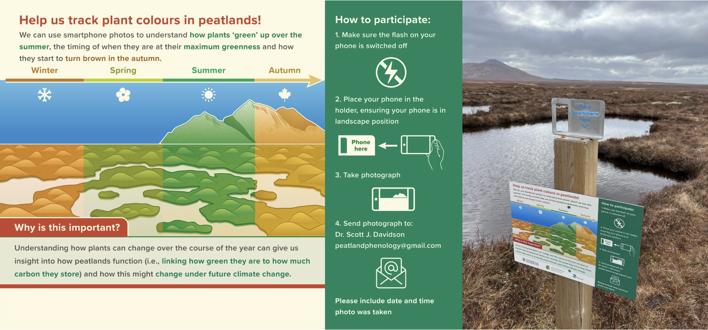{fig-align="center"} 

Any time someone visits a site, they can take a fixed-point photograph of the wetland using one of the specially designed phone cradles and send the photograph over. This allows us to build up a picture of how these wetlands change over the course of the year with regards to their colour.

You can access the photographs using the map below:

<iframe src="https://peatcolours.shinyapps.io/peatlands_map_app/" title="Processes" scrolling="yes" frameborder="0"
    style="border: 0;
   height: 100%;
   left: 0;
   position: absolute;
   top: 0;
   width: 100%;">

Your browser does not support iframes.

</iframe>

# Tracking the Colour of Peatlands data summary

  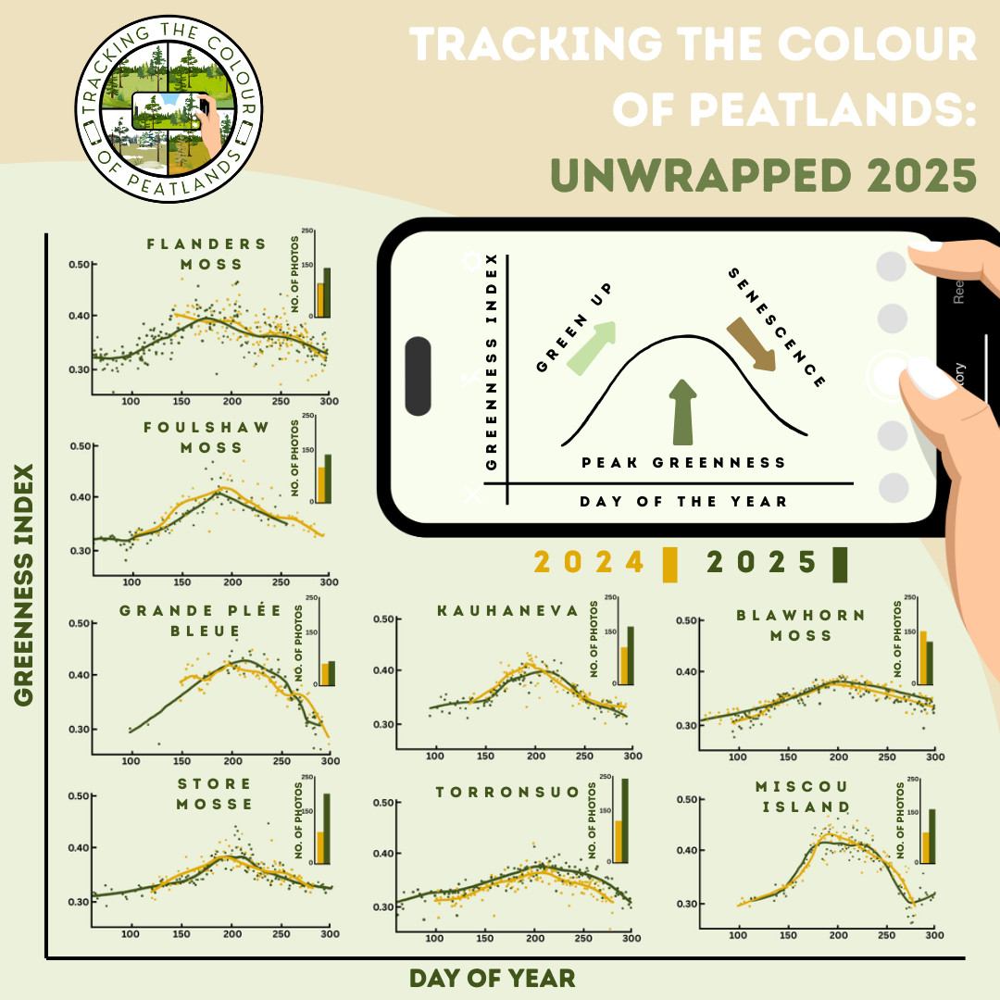
  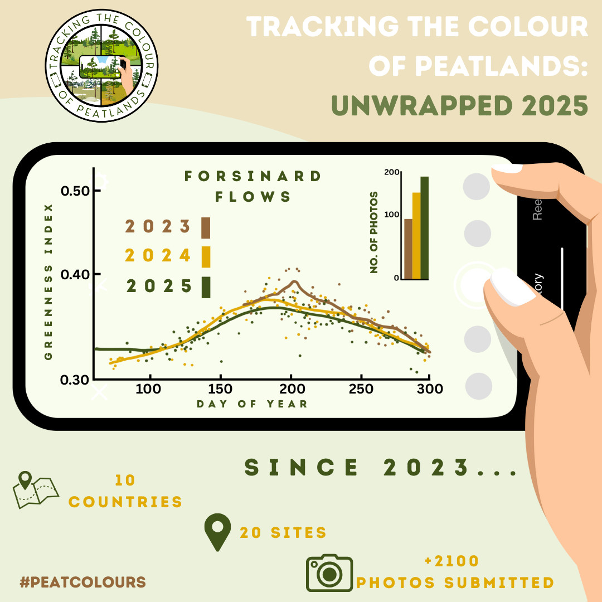

## Site details

### 🇨🇦 Canada

<strong>Grande Plée Bleue</strong>

**Location:** Québec, Canada  
**Peatland type:** Raised bog  
**Coordinates:** 46.772, -71.003  

🌐 [Site information](https://www.ville.levis.qc.ca/loisirs/grande-plee-bleue/)  
🗺 [View on map](https://maps.google.com/?q=46.772,-71.003)

<strong>Miscou</strong>

**Location:** New Brunswick, Canada  
**Peatland type:** Raised bog  
**Coordinates:** 47.948, -64.498  

🗺 [View on map](https://maps.google.com/?q=47.948,-64.498)

<strong>Boreal Wetland Centre</strong>

**Location:** Alberta, Canada  
**Peatland type:** Fen  

🌐 [Site information](https://www.borealwetlandcentre.com/)

### 🇦🇺 Australia

<strong>Cope Hut</strong>

**Location:** Victoria, Australia  
**Peatland type:** Alpine poor fen  
**Coordinates:** -36.906, 147.291  

🗺 [View on map](https://maps.google.com/?q=-36.906,147.291)

### 🇬🇧 United Kingdom

#### Scotland

<strong>Lochend</strong>

**Location:** Shetland, Scotland  
**Peatland type:** Blanket bog  
**Coordinates:** 60.246, -1.213  

🗺 [View on map](https://maps.google.com/?q=60.246,-1.213)

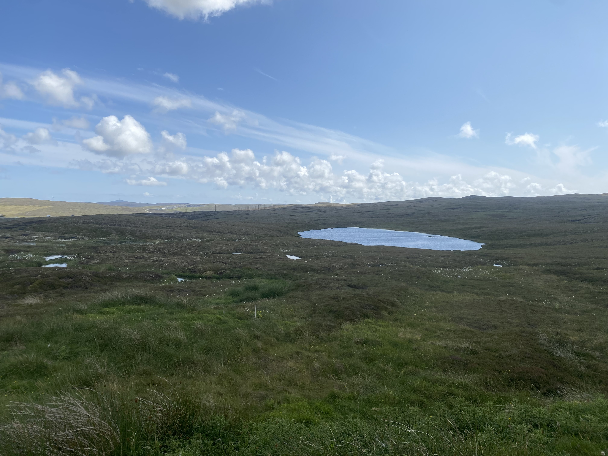

<strong>Forsinard Flows</strong>

**Location:** Scotland  
**Peatland type:** Blanket bog  
**Coordinates:** 58.353, -3.905  

🌐 [Site information](https://www.rspb.org.uk/days-out/reserves/forsinard-flows)  
🗺 [View on map](https://maps.google.com/?q=58.353,-3.905)

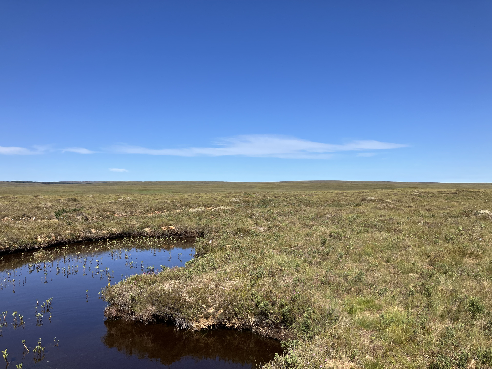

<strong>Flanders Moss</strong>

**Location:** Scotland  
**Peatland type:** Raised bog  
**Coordinates:** 56.133, -4.317  

🌐 [Site information](https://www.nature.scot/enjoying-outdoors/visit-our-nature-reserves/flanders-moss-national-nature-reserve)  
🗺 [View on map](https://maps.google.com/?q=56.133,-4.317)

<strong>Blawhorn Moss</strong>

**Location:** Scotland  
**Peatland type:** Raised bog  
**Coordinates:** 55.893, -3.789  

🌐 [Site information](https://www.nature.scot/enjoying-outdoors/visit-our-nature-reserves/blawhorn-moss-national-nature-reserve)  
🗺 [View on map](https://maps.google.com/?q=55.893,-3.789)

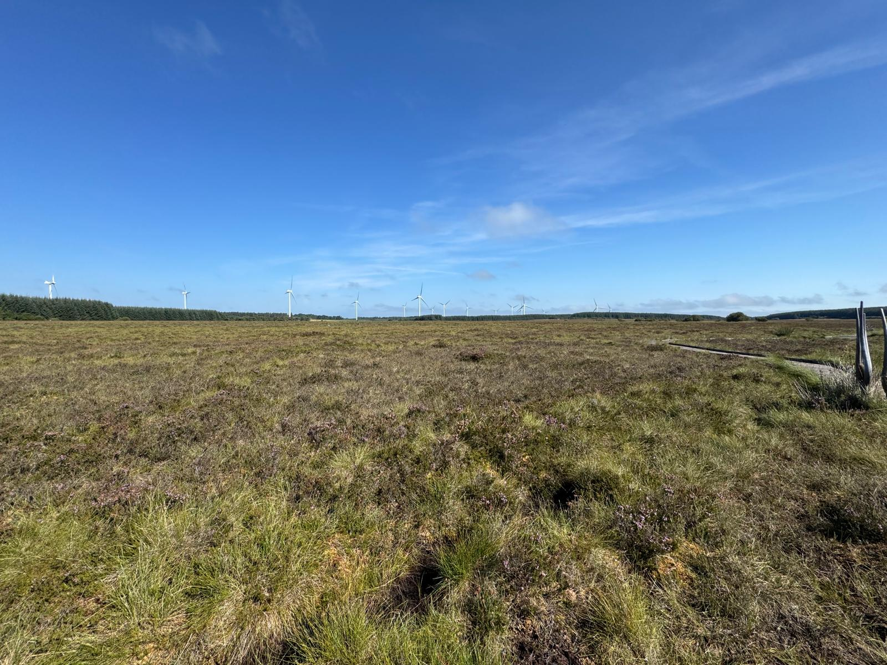

#### England

<strong>Foulshaw Moss</strong>

**Location:** England  
**Peatland type:** Raised bog  
**Coordinates:** 54.247, -2.832  

🌐 [Site information](https://www.cumbriawildlifetrust.org.uk/nature-reserves/foulshaw-moss)  
🗺 [View on map](https://maps.google.com/?q=54.247,-2.832)

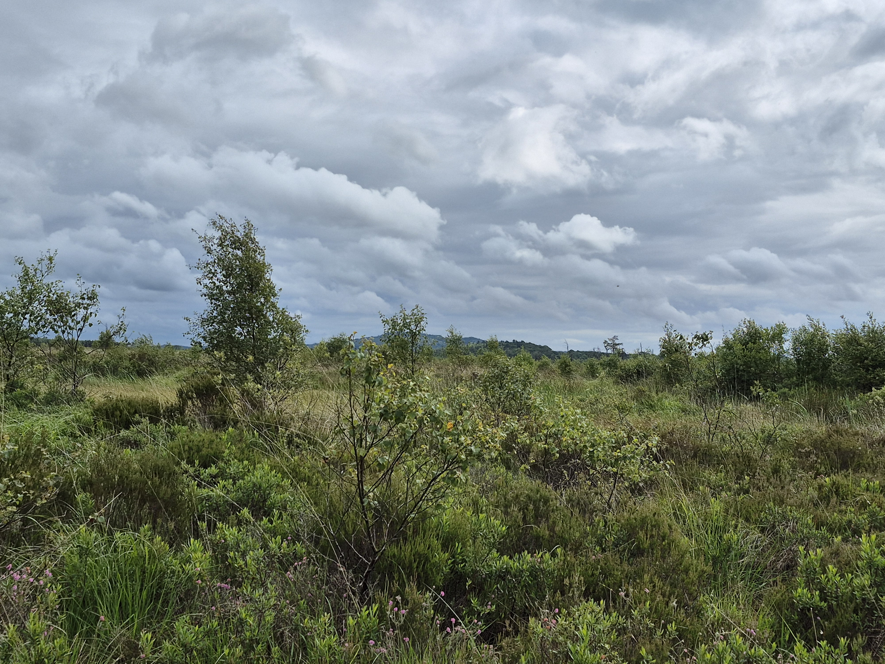

<strong>Clough Moor</strong>

**Location:** England  
**Peatland type:** Blanket bog  

#### Wales

<strong>Cors Fochno</strong>

**Location:** Wales  
**Peatland type:** Raised bog  
**Coordinates:** 52.503, -4.019  

🗺 [View on map](https://maps.google.com/?q=52.503,-4.019)

<strong>Cors Fochno 2</strong>

**Location:** Wales  
**Peatland type:** Raised bog  

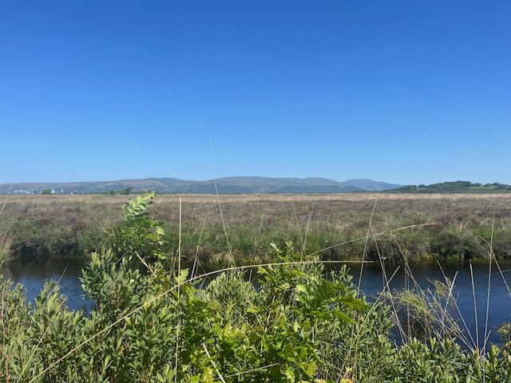

<strong>Castell Nos</strong>

**Location:** Wales  
**Peatland type:** Restored bog  
**Coordinates:** 51.690, -3.504  

🗺 [View on map](https://maps.google.com/?q=51.690,-3.504)

### 🇮🇪 Ireland

<strong>Killarney</strong>

**Location:** Ireland  
**Peatland type:** Blanket bog  
**Coordinates:** 51.978, -9.53852  

🗺 [View on map](https://maps.google.com/?q=51.978,-9.53852)

### 🇫🇷 France

<strong>Jouvion</strong>

**Location:** France  
**Peatland type:** Fen  
**Coordinates:** 45.485, 2.687  

🌐 [Site information](https://ens.puy-de-dome.fr/les-ens/tourbiere-de-jouvion.html)  
🗺 [View on map](https://maps.google.com/?q=45.485,2.687)

### 🇸🇪 Sweden

<strong>Store Mosse</strong>

**Location:** Sweden  
**Peatland type:** Raised bog  
**Coordinates:** 57.281, 13.910  

🌐 [Site information](https://www.sverigesnationalparker.se/en/choose-park---list/store-mosse-national-park/)  
🗺 [View on map](https://maps.google.com/?q=57.281,13.910)

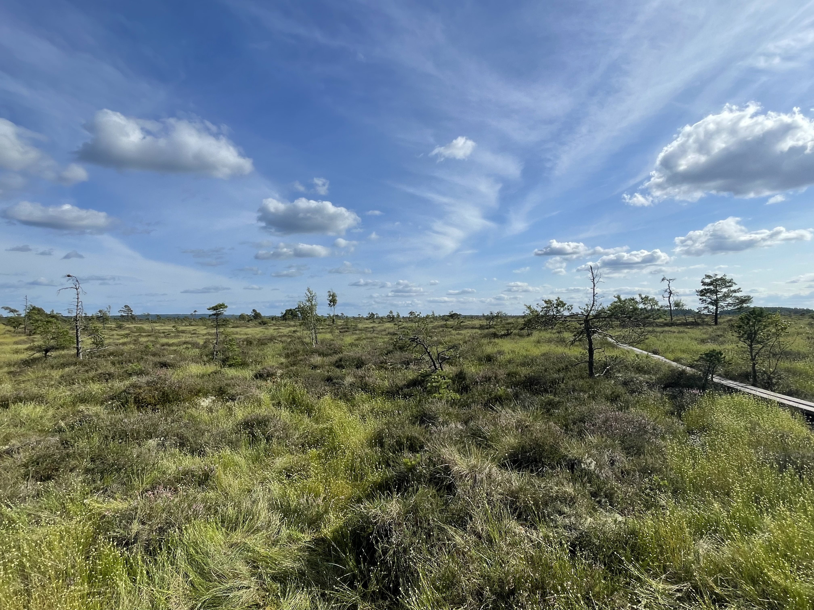

### 🇫🇮 Finland

<strong>Kauhaneva</strong>

**Location:** Finland  
**Peatland type:** Raised bog  
**Coordinates:** 62.204, 22.429  

🌐 [Site information](https://retkeilelakeuksilla.fi/retkikohteet/kauhanevan-pohjankankaan-kansallispuisto/)  
🗺 [View on map](https://maps.google.com/?q=62.204,22.429)

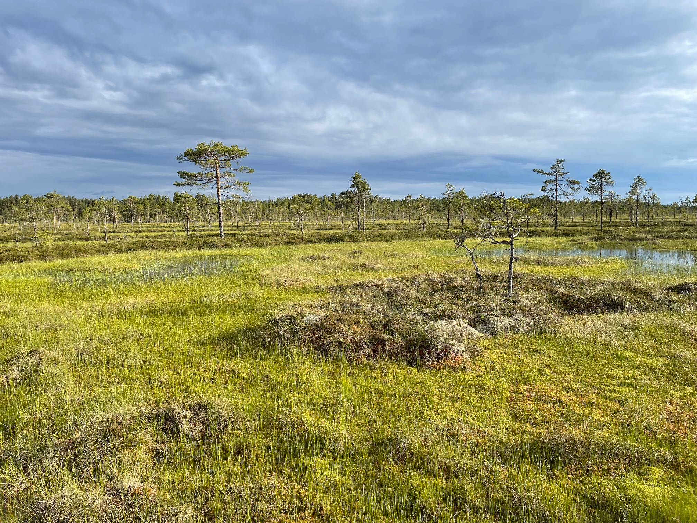

<strong>Torronsuo</strong>

**Location:** Finland  
**Peatland type:** Raised bog  
**Coordinates:** 60.731, 23.634  

🌐 [Site information](https://www.visitfinland.com/en/product/05a7f953-f517-4bab-a470-e50cc2696b68/torronsuo-national-park/)  
🗺 [View on map](https://maps.google.com/?q=60.731,23.634)

### 🇳🇱 Netherlands

<strong>Fochteloërveen</strong>

**Location:** The Netherlands  
**Peatland type:** Fen  

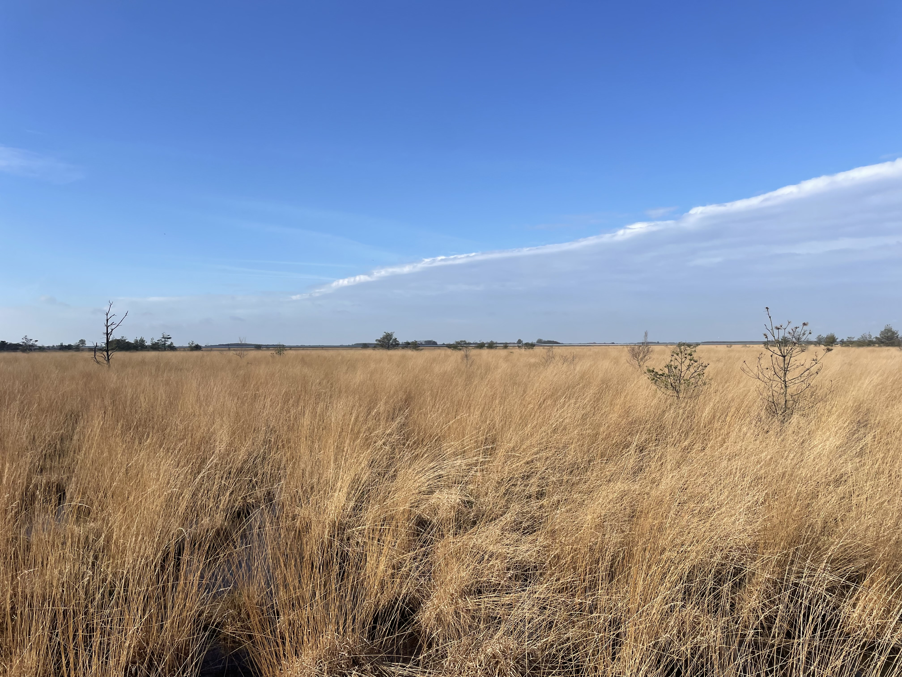

*Project funding*: 
Sustainable Earth Institute, University of Plymouth

*Project partners*: 
RSPB Scotland, UK 
Ducks Unlimited Canada 
Government of New Brunswick’s Department of Natural Resources, Canada 
The National Parks & Wildlife Service, Killarney National Park, Ireland 
Store Mosse National Park, County Administrative Board, Länsstyrelsen i Jönköpings län, Sweden 
Lauhanvuori – Hämeenkangas UNESCO Global Geopark and Metsähallitus National Parks, Finland 
Parc Naturel régional des Volcans d’Auvergne, France 
Natural Resources Wales 
Sue White - Peatland Action, Scotland 
NatureScot 
Société de conservation et de mise en valeur de la Grande plée Bleue / Ville de Lévis / Ministère de l’Environnement, de la Lutte contre les changements climatiques, de la Faune et des Parcs, Canada  
Parks Victoria, Australia

